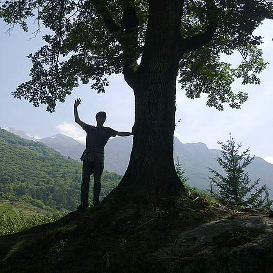

My name is Paul Rougieux, I am a wood products engineer and forest economist.

This site contains useful tools and data to analyse the forest sector.

This website was created using [Rmarkdown](http://rmarkdown.rstudio.com/rmarkdown_websites.html) and the [source code](https://github.com/paulrougieux/paulrougieux.github.io/) is available.
